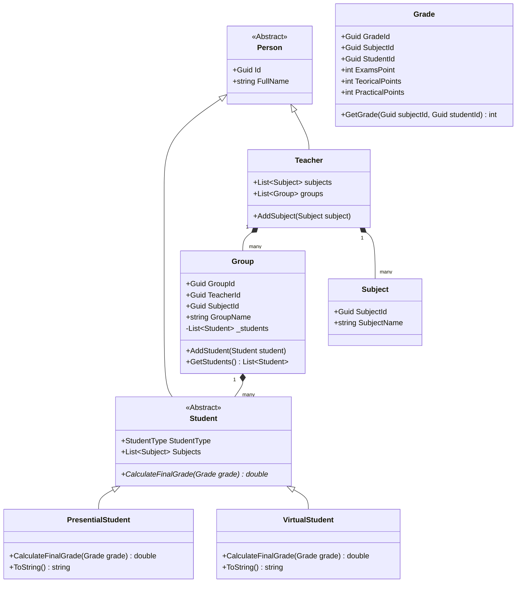

# Documentación del Sistema - Gestión de Estudiantes

Este documento proporciona una visión detallada de la arquitectura, estructura de clases y decisiones de diseño para la aplicación de Gestión de Estudiantes.

---

## 🏗️ Arquitectura General

El sistema está estructurado en 4 capas lógicas de diseño para maximizar la separación de responsabilidades y facilitar su mantenimiento:

```
┌────────────────────────────────────────────────────────┐
│              Capa de Presentación (Program/Menu)       │
└───────────────────────────┬────────────────────────────┘
                            │ Usa servicios
┌───────────────────────────▼────────────────────────────┐
│              Capa de Lógica (UniversityService)        │
└───────────────────────────┬────────────────────────────┘
                            │ Manipula entidades y datos
┌───────────────────────────▼────────────────────────────┐
│              Capa de Datos Semilla (AddingEntities)    │
└────────────────────────────────────────────────────────┘
                            │ Inicializa
┌───────────────────────────▼────────────────────────────┐
│              Capa de Entidades (Entities / Enums)      │
└────────────────────────────────────────────────────────┘
```

---

## 📊 Diagrama de Clases

La estructura orientada a objetos utiliza herencia para reutilizar atributos comunes (id, nombre completo) de los estudiantes, y polimorfismo para cambiar el comportamiento del cálculo de las notas según el tipo de inscripción:



---

## 🛠️ Conceptos de Programación Orientada a Objetos Aplicados

### 1. Herencia y Abstracción
- **Clase Base `Person`**: Encapsula el `Id` único (Guid) y el `FullName` común para alumnos y docentes.
- **Clase Base `Student`**: Hereda de `Person` y abstrae la estructura que representa a un estudiante genérico dentro de una materia, definiendo las firmas para el polimorfismo.

### 2. Polimorfismo (Sobreescritura de Métodos)
El cálculo de la nota final depende exclusivamente de la modalidad del estudiante (`StudentType`):
- **Estudiante Presencial (`PresentialStudent`)**:
  $$\text{Nota Final} = \text{Examen (máx 70)} + \text{Teoría (máx 10)} + \text{Práctica (máx 20)}$$
- **Estudiante Virtual (`VirtualStudent`)**:
  $$\text{Nota Final} = \text{Examen (máx 60)} + \text{Práctica (máx 40)}$$
  *(La nota teórica no aplica y se ignora).*

Ambas clases heredan de `Student` y sobreescriben `CalculateFinalGrade(Grade grade)`. También sobreescriben `ToString()` para representarse de forma personalizada en la UI.

---

## 📝 Patrón OperationResult (Manejo de Errores)

Para desacoplar la interfaz de usuario de las validaciones de negocio e implementar un control de errores robusto, todas las operaciones críticas de `UniversityService` devuelven una instancia de `OperationResult`:

- **Estructura**:
  - `success` (`bool`): Indica si la operación fue exitosa.
  - `message` (`string`): Información textual sobre el resultado o mensaje de error.
  - `data` (`dynamic`): Objeto opcional con el payload de datos generados.

---

## 📂 Descripción de Componentes

1. **[Program.cs](file:///c:/Practicas%20estructura%20de%20datos/GestionEstudiantes/GestionEstudiantes/Program.cs)**: Punto de entrada principal simplificado del sistema.
2. **[ConsoleMenu.cs](file:///c:/Practicas%20estructura%20de%20datos/GestionEstudiantes/GestionEstudiantes/Services/ConsoleMenu.cs)**: Gestión e interacción del usuario en la CLI de consola sin elementos innecesarios.
3. **[UniversityService.cs](file:///c:/Practicas%20estructura%20de%20datos/GestionEstudiantes/GestionEstudiantes/Services/UniversityService.cs)**: Orquestador que valida y ejecuta los casos de uso (agregar estudiantes, calificar, calcular porcentajes).
4. **[AddingEntities.cs](file:///c:/Practicas%20estructura%20de%20datos/GestionEstudiantes/GestionEstudiantes/Data/AddingEntities.cs)**: Inicializador de almacenamiento en memoria volatil.
